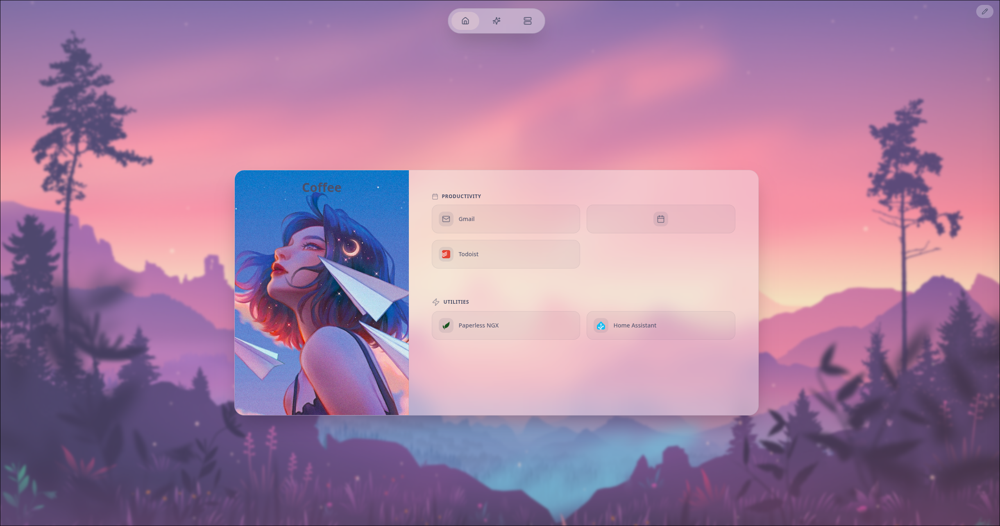
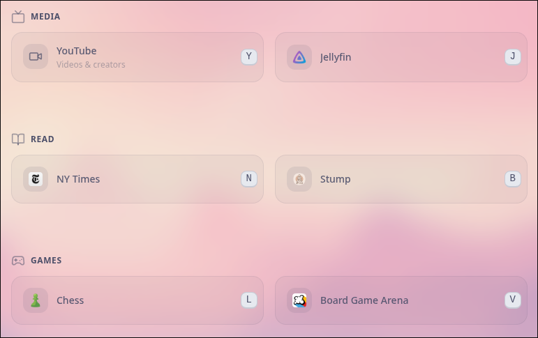
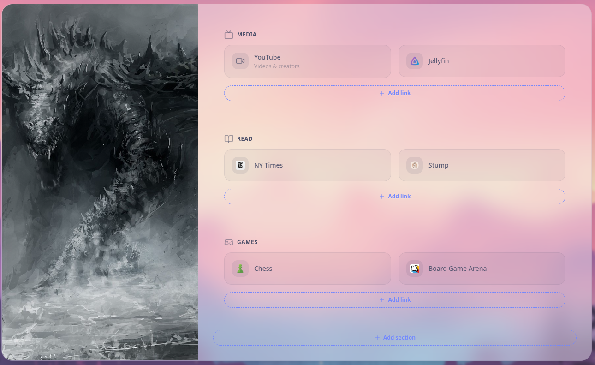
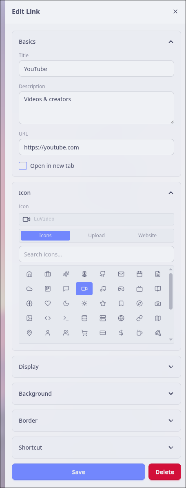

# Helm



Yet another self-hosted, deeply customizable bookmark dashboard and browser start page.

Helm organizes your links into tabs, sections, and bookmarks, and lets you restyle almost every pixel. You can change gradients, themes, background images, per-element
colors and borders, keyboard shortcuts, and more.

Everything is stored in a local SQLite database, so it's easy to run
anywhere and back up.


## Features

- **Tabs → Sections → Bookmarks** — organize links into a navigable, multi-tab layout with grouped sections.
- **Keyboard shortcuts** — assign hotkeys to tabs and links for fast, mouse-free navigation, with optional on-screen indicators.
- **Custom backgrounds** — set a background image with adjustable blur and a configurable gradient overlay.
- **Granular theming** — customize colors, gradients, borders, backgrounds, and opacity at the dashboard, tab, section, and link level.
- **Configurable layout** — choose tab bar position, column counts, header alignment, pill styling, and settings-button appearance.
- **Image uploads & favicons** — upload your own images and auto-fetch site favicons for bookmarks.
- **No external services** — all data lives in a local SQLite file.

## Showcases

## Screenshots

Pressing `SPACE` activates **Shortcut Mode**. Shortcut keys can be added to tabs/bookmarks and can be activated per tab or globally.



Edit `Edit Button` enables **Edit Mode**. Tabs, sections, and bookmarks can be added, removed and edited in this mode. Dashboard settings can be accessed by editing the `Title/Subtitle` block.



Displayed are the options for editing a `Bookmark`. `Bookmark Groups`, `Dashboard`, `Tabs`, and `Tab Content` all have similarly customizable properties.




## Getting Started with Docker

Helm is published as a container image at [`ghcr.io/isaacvarg/helm`](https://github.com/isaacvarg/helm/pkgs/container/helm).

The container automatically runs database migrations on startup, and all data persists in two volumes — one for the SQLite database and one for uploaded images.

### Docker Compose

Create a `compose.yaml`:

```yaml
services:
  helm:
    image: ghcr.io/isaacvarg/helm:latest
    container_name: helm
    restart: unless-stopped
    ports:
      - "3000:3000"
    volumes:
      - helm-db:/app/prisma
      - helm-uploads:/app/public/uploads
    environment:
      DATABASE_URL: "file:./prisma/main.db"

volumes:
  helm-db:
  helm-uploads:
```

Then start it:

```bash
docker compose up -d
```

Open <http://localhost:3000>.

### docker run

```bash
docker run -d \
  --name helm \
  --restart unless-stopped \
  -p 3000:3000 \
  -v helm-db:/app/prisma \
  -v helm-uploads:/app/public/uploads \
  -e DATABASE_URL="file:./prisma/main.db" \
  ghcr.io/isaacvarg/helm:latest
```

### Build the image from source

If you'd rather build locally, the repo ships a `Dockerfile` and a
`docker-compose.yml` configured with `build: .`:

```bash
git clone https://github.com/isaacvarg/helm.git
cd helm
docker compose up -d --build
```

## Run Locally (development)

**Prerequisites:** [Node.js](https://nodejs.org) 20+ and
[pnpm](https://pnpm.io) (`corepack enable`).

```bash
# clone repo
git clone https://github.com/isaacvarg/helm.git
cd helm

# copy the example environment file
cp .env.example .env

# install dependencies
pnpm install

# set up the database
pnpm prisma migrate deploy
pnpm prisma generate

# (optional) seed a demo dashboard
pnpm run db:seed

# start the dev server
pnpm dev
```

Open <http://localhost:3000>.

## Configuration

Helm needs only a single environment variable. Everything else is configured
through the in-app settings UI rather than env vars.

| Variable       | Description                          | Default                 |
| -------------- | ------------------------------------ | ----------------------- |
| `DATABASE_URL` | SQLite connection string (file path) | `file:./prisma/main.db` |

Persistent data lives in two locations (mounted as volumes in Docker):

- **Database** — `prisma/main.db`
- **Uploaded images** — `public/uploads`

## Tech Stack

- [Next.js 16](https://nextjs.org) (App Router) + [React 19](https://react.dev)
- [Prisma 7](https://www.prisma.io) with SQLite (`better-sqlite3` adapter)
- [Tailwind CSS v4](https://tailwindcss.com) +
  [daisyUI 5](https://daisyui.com) with the
  [Catppuccin](https://github.com/catppuccin/daisyui) theme
- [Zustand](https://zustand-demo.pmnd.rs) for state,
  [Motion](https://motion.dev) for animation
- [react-hotkeys-hook](https://react-hotkeys-hook.vercel.app) for keyboard
  shortcuts, [react-icons](https://react-icons.github.io/react-icons) for icons

## Thanks

The default wallpaper comes from:

- [Catppuccin Wallpapers](https://github.com/zhichaoh/catppuccin-wallpapers)
